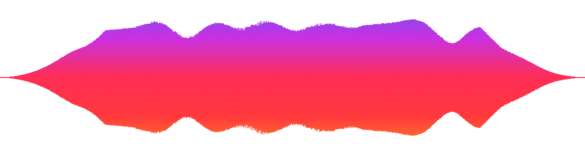
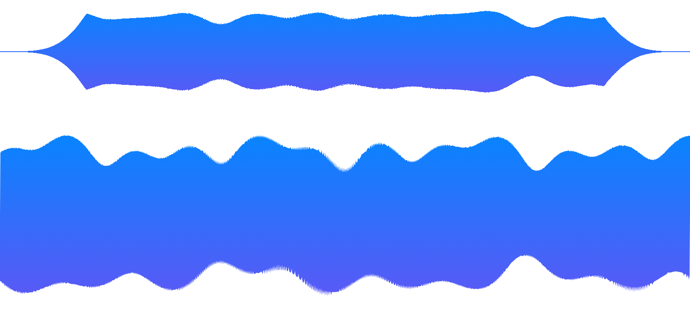
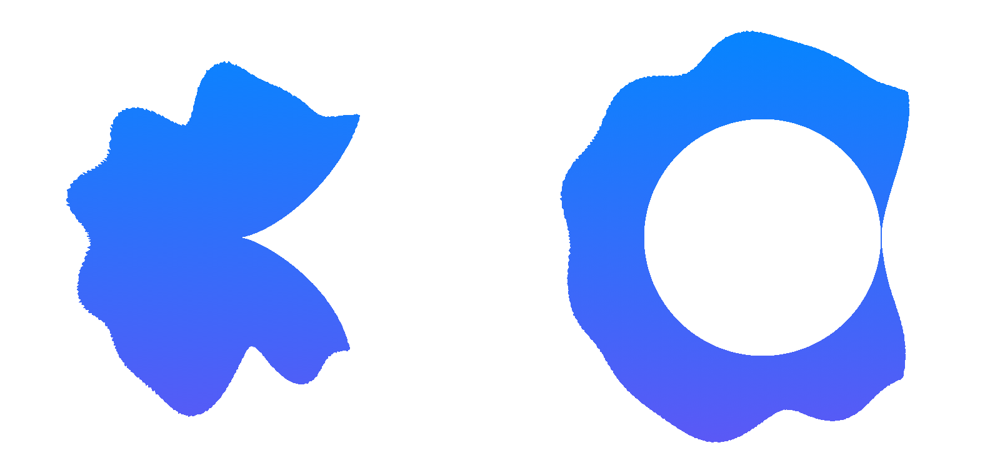
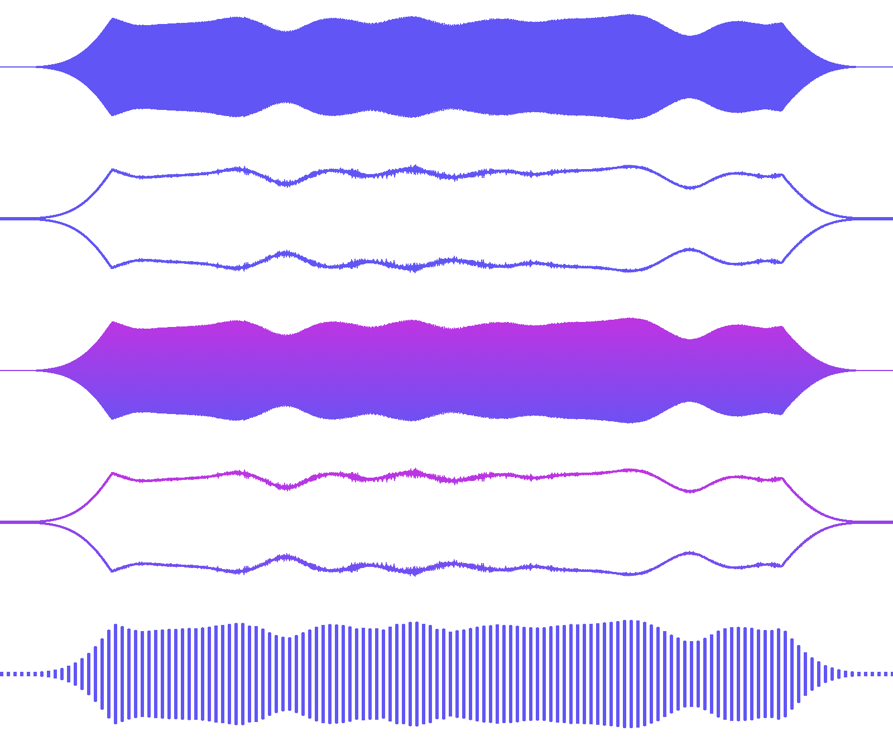
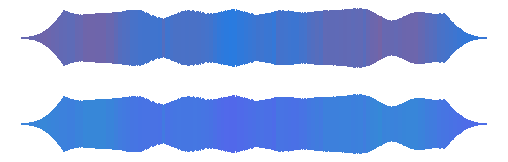
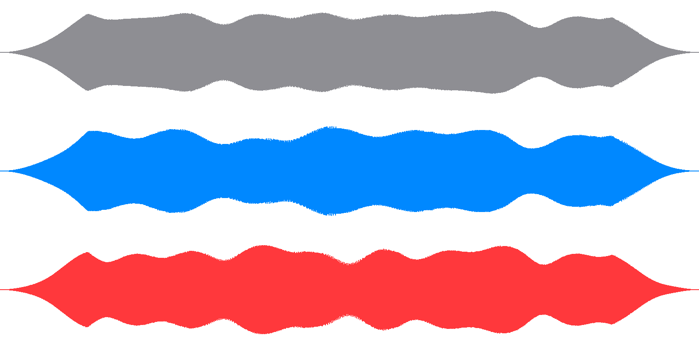
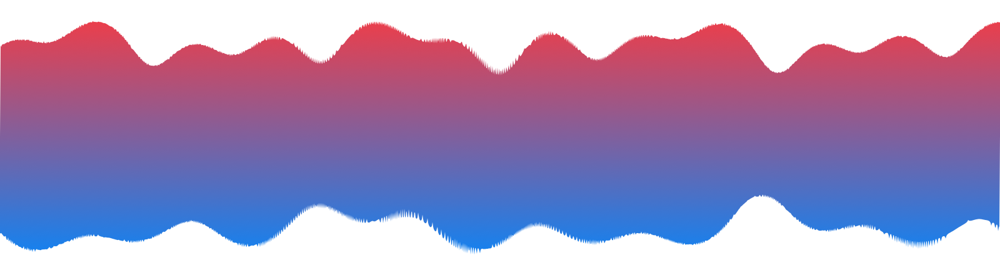
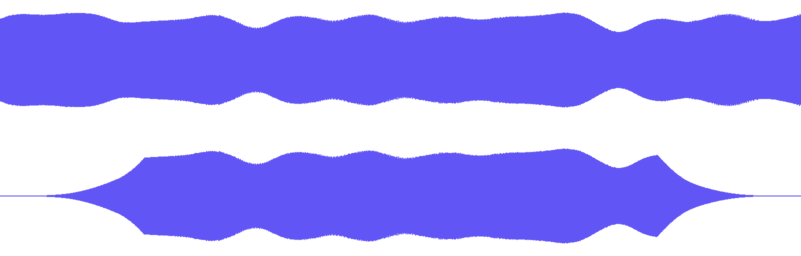
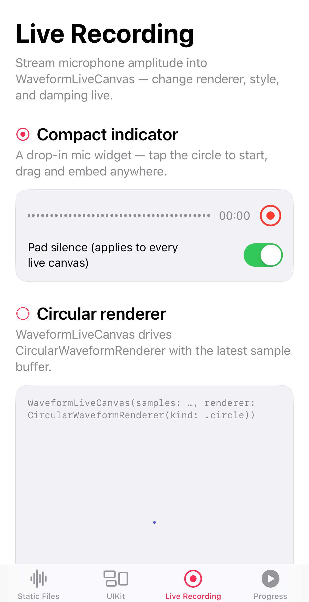
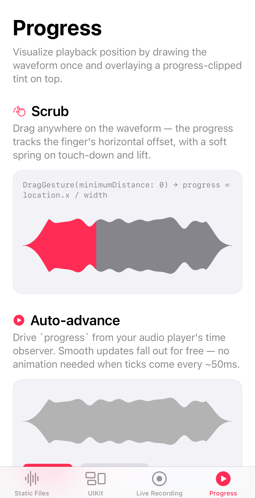

# DSWaveformImage

[](https://swift.org/package-manager)

Native audio waveform rendering for **iOS**, **iPadOS**, **macOS**, **visionOS**, and Mac Catalyst.

<p align="center"></p>

Three layers, pick whichever fits:

- **SwiftUI views** — [`WaveformView`](Sources/DSWaveformImageViews/SwiftUI/WaveformView.swift), [`InteractiveWaveformView`](Sources/DSWaveformImageViews/SwiftUI/InteractiveWaveformView.swift), [`InteractiveWaveformTimeline`](Sources/DSWaveformImageViews/SwiftUI/InteractiveWaveformTimeline.swift), [`WaveformLiveCanvas`](Sources/DSWaveformImageViews/SwiftUI/WaveformLiveCanvas.swift), [`WaveformShape`](Sources/DSWaveformImageViews/SwiftUI/WaveformShape.swift)
- **UIKit views** — [`WaveformImageView`](Sources/DSWaveformImageViews/UIKit/WaveformImageView.swift), [`WaveformLiveView`](Sources/DSWaveformImageViews/UIKit/WaveformLiveView.swift)
- **Raw API** — [`WaveformImageDrawer`](Sources/DSWaveformImage/WaveformImageDrawer.swift) renders to `UIImage` / `NSImage`; [`WaveformAnalyzer`](Sources/DSWaveformImage/WaveformAnalyzer.swift) gives you the normalized `[Float]` samples to do your own thing with.

Editor-style interactions are built in too: **pinch-to-zoom**, **drag-to-pan**, a **zoom-aware time ruler**, **playhead scrubbing**, **trim / crop handles**, and a **full-file overview** strip — see [Zoom, timeline & trim](#zoom-timeline--trim).

The `Example/` directory contains a multi-platform showcase ([`WaveformGalleryView`](Example/Shared/WaveformGalleryView.swift)) that exercises every public surface interactively — recommended for poking around with renderers, styles, and configurations together. The **Zoom** tab ([`ZoomScrollShowcase`](Example/Shared/ZoomScrollShowcase.swift)) demos the interactive timeline end-to-end.

## Installation

Add the package via [Swift Package Manager](https://swift.org/package-manager):

```
https://github.com/hoangnam714/DSWaveformImage
```

**Xcode:** File → Add Package Dependencies… → paste the URL above → set dependency rule to **Up to Next Major** from `15.0.0`, or select branch `main` for the latest tip.

**`Package.swift`:**

```swift
dependencies: [
    .package(url: "https://github.com/hoangnam714/DSWaveformImage.git", from: "15.0.0")
]
```

```swift
import DSWaveformImage       // core: drawer, analyzer, renderers, types
import DSWaveformImageViews  // UIKit + SwiftUI views (optional)
```

## Quick start

**SwiftUI**

```swift
WaveformView(audioURL: url)
```

**UIKit**

```swift
let view = WaveformImageView(frame: .init(x: 0, y: 0, width: 500, height: 300))
view.waveformAudioURL = url
```

**Raw `UIImage` / `NSImage`**

```swift
let image = try await WaveformImageDrawer().waveformImage(
    fromAudioAt: url,
    with: .init(size: size, style: .filled(.black))
)
```

# Gallery

Every feature, once. Most options compose with most others — the example app's [`WaveformGalleryView`](Example/Shared/WaveformGalleryView.swift) lets you explore the permutations interactively.

## Linear renderer

[`LinearWaveformRenderer`](Sources/DSWaveformImage/Renderers/LinearWaveformRenderer.swift) is the default — a horizontal 2D amplitude envelope. `sides` controls which side of the centerline the envelope occupies (`.both`, `.up`, `.down`). `.stereo` is a factory that interprets a two-channel sample array as left-on-top / right-on-bottom in a single image.



```swift
WaveformView(audioURL: url, renderer: LinearWaveformRenderer())            // default
WaveformView(audioURL: url, renderer: LinearWaveformRenderer(sides: .up))  // top-only
WaveformView(audioURL: url, renderer: LinearWaveformRenderer.stereo)       // stereo
```

## Circular renderer

[`CircularWaveformRenderer`](Sources/DSWaveformImage/Renderers/CircularWaveformRenderer.swift) wraps the envelope around a circle. `.circle` fills the disk; `.ring(innerFraction)` cuts a hole, producing an annulus driven by the same envelope.



```swift
WaveformView(audioURL: url, renderer: CircularWaveformRenderer(kind: .circle))
WaveformView(audioURL: url, renderer: CircularWaveformRenderer(kind: .ring(0.5)))
```

You can also implement your own renderer by conforming to [`WaveformRenderer`](Sources/DSWaveformImage/Renderers/WaveformRenderer.swift).

## Styles

[`Waveform.Style`](Sources/DSWaveformImage/WaveformImageTypes.swift) controls how the envelope is drawn — same renderer throughout. Top to bottom: `.filled`, `.outlined`, `.gradient`, `.gradientOutlined`, `.striped`.



```swift
.filled(.indigo)
.outlined(.indigo, 1.5)
.gradient([.blue, .purple])
.gradientOutlined([.blue, .purple], 1.5)
.striped(.init(color: .indigo, width: 3, spacing: 3))
```

## Spectral tint

`.spectralTint(low:high:)` colors each amplitude column by its spectral centroid — bass-heavy columns get the `low` color, treble-heavy columns get the `high` color, with smooth interpolation in between. The envelope shape stays identical to the non-spectral path; only the fill follows the audio's frequency content over time.



```swift
WaveformView(audioURL: url, configuration: .init(
    style: .spectralTint(low: .systemBlue, high: .systemRed)
))
```

Renderers that opt in to spectral data conform to [`SpectralAwareWaveformRenderer`](Sources/DSWaveformImage/WaveformImageTypes.swift); ones that don't fall back to filling with the `low` color. `LinearWaveformRenderer` conforms by default.

## Channel selection

Channel handling lives on the renderer, not on `Configuration`. `.merged` (default) sums all channels; `.specific(index)` picks one; `.stereo` is its own thing — see below.



```swift
LinearWaveformRenderer(channelSelection: .merged)        // default
LinearWaveformRenderer(channelSelection: .specific(0))   // left only
LinearWaveformRenderer(channelSelection: .specific(1))   // right only
```

When you're calling [`WaveformAnalyzer`](Sources/DSWaveformImage/WaveformAnalyzer.swift) directly for raw samples, pass `channelSelection` there instead.

## Stereo

`LinearWaveformRenderer.stereo` interprets a `[allLeft..., allRight...]` sample array as left on top, right on bottom, in one image.



```swift
WaveformView(audioURL: url, configuration: .init(
    style: .gradient([.blue, .red])
), renderer: LinearWaveformRenderer.stereo)
```

## Amplitude scaling

`Waveform.AmplitudeScaling` chooses how sample loudness maps to the canvas:

- `.absolute` (default) — fixed `0 dBFS` reference. Quiet recordings render visibly smaller than loud ones; loudness across files is preserved.
- `.normalized` — shift the file's peak to the canvas edge so every clip fills the canvas regardless of recording level. The envelope shape is preserved.

```swift
.init(style: .filled(.indigo), amplitudeScaling: .normalized)
```

## Damping

`Waveform.Damping` fades the envelope toward zero at one or both ends — useful for live capture where the leading/trailing edge would otherwise look like a hard cut.



```swift
.init(style: .filled(.indigo), damping: .init(percentage: 0.18, sides: .both))
```

Pass a custom `easing:` closure to shape the falloff (e.g. `{ x in pow(x, 4) }`).

## Custom shape (SwiftUI)

`WaveformView`'s trailing closure hands you the underlying [`WaveformShape`](Sources/DSWaveformImageViews/SwiftUI/WaveformShape.swift) so you can apply any SwiftUI `ShapeStyle` — `LinearGradient`, masks, animations, anything Shape supports. Thanks to [@alfogrillo](https://github.com/alfogrillo) for the API.

```swift
WaveformView(audioURL: url) { shape in
    shape.stroke(
        LinearGradient(colors: [.purple, .blue, .cyan], startPoint: .leading, endPoint: .trailing),
        style: StrokeStyle(lineWidth: 3, lineCap: .round)
    )
} placeholder: {
    ProgressView()
}
```

If you already have samples, instantiate [`WaveformShape`](Sources/DSWaveformImageViews/SwiftUI/WaveformShape.swift) directly:

```swift
WaveformShape(samples: samples).fill(.indigo)
```

## Live recording

[`WaveformLiveCanvas`](Sources/DSWaveformImageViews/SwiftUI/WaveformLiveCanvas.swift) (SwiftUI) and [`WaveformLiveView`](Sources/DSWaveformImageViews/UIKit/WaveformLiveView.swift) (UIKit) render a `[Float]` sample stream in real time. Pair with `AVAudioRecorder` or any other source that reports per-frame amplitudes.

<p align="center"></p>

```swift
// SwiftUI
WaveformLiveCanvas(samples: recorder.samples, shouldDrawSilencePadding: true)

// UIKit
let view = WaveformLiveView()
recorder.updateMeters()
let amplitude = 1 - pow(10, recorder.averagePower(forChannel: 0) / 20)
view.add(sample: amplitude)
```

For a complete recording demo see `LiveRecordingShowcase` in the [example app](Example/Shared/LiveRecordingShowcase.swift).

## Progress / playback

Render the waveform once and overlay a progress-clipped tint on top. The base shape stays static; only the foreground mask reacts to playback time.

<p align="center"></p>

```swift
GeometryReader { geometry in
    WaveformView(audioURL: url) { shape in
        shape.fill(.secondary)
        shape.fill(.accentColor).mask(alignment: .leading) {
            Rectangle().frame(width: geometry.size.width * progress)
        }
    }
}
```

The same idea works with two image views and a `CAShapeLayer` mask in UIKit — see [`UIKitShowcaseViewController.swift`](Example/DSWaveformImageExample-iOS/UIKitShowcaseViewController.swift). There's no built-in `ProgressWaveformView`; every app's playback model is different and the masking trick is small enough that wrapping it would just be in your way.

## Zoom, timeline & trim

Build audio-editor UIs on top of the same analysis pipeline: one high-resolution sample cache, then zoom / pan / trim without re-decoding the file.

### Pinch-to-zoom & pan

[`InteractiveWaveformView`](Sources/DSWaveformImageViews/SwiftUI/InteractiveWaveformView.swift) adds pinch-to-zoom and drag-to-pan. Bind `zoom` and `visibleRange` when you need to sync with a playhead or external controls; use [`InteractiveWaveform`](Sources/DSWaveformImageViews/SwiftUI/InteractiveWaveformView.swift) when you just want the gestures with internal state.

```swift
@State private var zoom: CGFloat = 1
@State private var visibleRange: Waveform.VisibleRange = .full

InteractiveWaveformView(
    audioURL: url,
    zoom: $zoom,
    visibleRange: $visibleRange,
    maximumZoom: 8
) { shape in
    shape.stroke(
        LinearGradient(colors: [.purple, .blue, .cyan], startPoint: .leading, endPoint: .trailing),
        style: StrokeStyle(lineWidth: 3, lineCap: .round)
    )
}
.frame(height: 120)
```

| Binding | Meaning |
| --- | --- |
| `zoom` | `1` = fit the full file; up to `maximumZoom` |
| `visibleRange` | Normalized window into the file (`0...1` of total duration) |

`Waveform.VisibleRange.from(zoom:start:)` keeps the window span equal to `1 / zoom` and clamps the start so it never scrolls past the ends.

Under the hood, analysis runs once at `viewportWidth × scale × maximumZoom`. At a given zoom the full file is drawn into a **wide** layer; panning only translates that layer so the envelope stays stable (no per-frame re-slice shimmer). Double-tap to reset is left to you — the example does `zoom = 1; visibleRange = .full`.

Inside a parent `ScrollView`, call `.disablesScrollDuringWaveformInteraction()` on the scroll container so pan/pinch aren't stolen mid-gesture.

### Interactive timeline (ruler + playhead + trim)

[`InteractiveWaveformTimeline`](Sources/DSWaveformImageViews/SwiftUI/InteractiveWaveformTimeline.swift) is the editor-style strip: zoomable waveform, **time ruler**, **draggable playhead**, optional **trim / crop handles**, and a **full-file overview**.

```swift
@State private var zoom: CGFloat = 1
@State private var visibleRange: Waveform.VisibleRange = .full
@State private var progress: Double = 0.35          // playhead, 0...1
@State private var selection = Waveform.Timeline.Selection(start: 0.15, end: 0.85) // trim

InteractiveWaveformTimeline(
    audioURL: url,
    zoom: $zoom,
    visibleRange: $visibleRange,
    progress: $progress,
    selection: $selection,
    showsTrimming: true,
    showsOverview: true,
    rulerStyle: .clock,       // or .decimal
    maximumZoom: 8,
    waveformHeight: 110,
    waveformColors: [.purple, .blue, .cyan]
)
```

**Gestures (single recognizer, hit-tested on touch-down):**

- **Pinch** — zoom in/out; the ruler rescales with the visible window
- **Drag** on the waveform — pan when zoomed in
- **Drag** the playhead — scrub `progress` (clamped inside the trim)
- **Drag** the yellow trim handles — update `selection.start` / `selection.end`
- **Overview** — always shows **100%** of the file; the yellow frame is the trim. Drag the frame to move it, drag its edges to resize

Playhead time labels hide automatically when they would overlap a trim handle.

### Time ruler

[`WaveformTimeRuler`](Sources/DSWaveformImageViews/SwiftUI/WaveformTimeRuler.swift) picks “nice” major/minor tick intervals from the visible duration via [`Waveform.Timeline.majorInterval`](Sources/DSWaveformImage/WaveformTimeline.swift). Labels switch precision with zoom:

| Zoom | Example labels |
| --- | --- |
| Coarse (`≥ 1s` ticks) | `0:02`, `0:05` |
| Medium | `0:02.0`, `0:02.5` |
| Fine | `0:02.45` |

Styles: `.clock` (`m:ss` / `m:ss.d`) or `.decimal` (`2.0`, `2.5`).

### Trim / crop selection

`Waveform.Timeline.Selection` is a normalized trim window (`start` / `end` in `0...1`, always `start < end`):

```swift
var selection = Waveform.Timeline.Selection(start: 0.2, end: 0.8)
selection.setStart(0.1)   // clamped so a minimum span remains
selection.setEnd(0.9)

let startTime = Waveform.Timeline.time(progress: selection.start, duration: duration)
let endTime   = Waveform.Timeline.time(progress: selection.end, duration: duration)
```

Map between pixels and progress with the same helpers the timeline uses:

```swift
let x = Waveform.Timeline.xPosition(progress: progress, visibleRange: visibleRange, width: width)
let p = Waveform.Timeline.progress(x: touchX, visibleRange: visibleRange, width: width)
```

### Overview strip

[`WaveformTimelineOverview`](Sources/DSWaveformImageViews/SwiftUI/WaveformTimelineOverview.swift) can also be used standalone: full-file mini waveform + draggable trim frame + playhead. `InteractiveWaveformTimeline` embeds it when `showsOverview: true`.

See `ZoomScrollShowcase` in the [example app](Example/Shared/ZoomScrollShowcase.swift) for a complete demo (timeline + freeform pinch/pan).

## Loading remote audio

`WaveformAnalyzer` and `WaveformImageDrawer` work with local file URLs. For a remote-audio recipe see [#22](https://github.com/dmrschmidt/DSWaveformImage/issues/22).

# Migration

### In 15.0.0

- **New `InteractiveWaveformView` / `InteractiveWaveform`** — pinch-to-zoom and drag-to-pan SwiftUI views, plus `Waveform.VisibleRange` and `WaveformSampleViewport` helpers for custom zoom UIs. Pan translates a zoom-cached layer (no per-frame re-slice flicker).
- **New `InteractiveWaveformTimeline`** — editor-style strip with zoom-aware time ruler, playhead scrubbing, trim/crop handles, and a full-file overview whose frame tracks the trim selection.
- **New `WaveformTimeRuler` / `WaveformTimelineOverview`** — reusable ruler and overview strip; clock labels add fractional seconds when zoomed in.
- **New `Waveform.Timeline`** — time formatting, major-tick picking, progress ↔ x mapping, and `Selection` for trim windows.
- **`Waveform.Style.spectralTint(low:high:)` is a new case.** Exhaustive `switch` statements over `Waveform.Style` will need to add it (or an `@unknown default`).
- **`Position.middle` waveforms render smaller at `verticalScalingFactor=1`.** The previous math overshot, letting peak-loud samples extend a full canvas height in each direction from the centerline. They now fill exactly the budget the centerline leaves available (half-canvas per direction for `.middle`, full canvas for `.top` / `.bottom`). Bump `verticalScalingFactor` if you want the old visual size.
- **Stereo + damping** now damps each channel half independently. Previously the damping ran across the concatenated `[allLeft..., allRight...]` array, so only the start of L and the end of R faded; the middle (end of L + start of R) got no damping at all.
- **Live stereo drawing window** doubled internally to cover both channels — fixes the left channel being silently dropped from the visible scroll window.
- `LinearWaveformRenderer` now also conforms to the new `SpectralAwareWaveformRenderer` protocol (additive).
- New `Waveform.AmplitudeScaling` (defaults to `.absolute`, preserves prior behavior). Adds an `amplitudeScaling:` parameter to `Waveform.Configuration.init` / `with(...)`, both with defaults.
- New `WaveformAnalyzer.analyze(...)` returns amplitudes + per-slot spectral centroids in one pass.

### In 14.0.0

- Minimum deployment target is iOS 15.0, macOS 12.0 to remove internal usage of deprecated APIs.
- `WaveformAnalyzer` and `WaveformImageDrawer` now return `Result<[Float] | DSImage, Error>` when used with completion handlers.
- `WaveformAnalyzer` is stateless and takes the URL in `samples(fromAudioAt:count:qos:)` instead of its constructor.
- `WaveformView` has a new constructor that exposes the underlying `WaveformShape`, see [#78](https://github.com/dmrschmidt/DSWaveformImage/issues/78).

### In 13.0.0

- `dampening` → `damping` everywhere (most notably in `Waveform.Configuration`). See [#64](https://github.com/dmrschmidt/DSWaveformImage/issues/64).
- `.outlined` and `.gradientOutlined` styles were added to `Waveform.Style`.
- `Waveform.Position` was removed. Move positioning responsibility to the parent view.

### In 12.0.0

- The rendering pipeline was split out from analysis — implement [`WaveformRenderer`](Sources/DSWaveformImage/Renderers/WaveformRenderer.swift) for custom renderers.
- New [`CircularWaveformRenderer`](Sources/DSWaveformImage/Renderers/CircularWaveformRenderer.swift).
- `position` removed from `Waveform.Configuration`, see [0447737](https://github.com/dmrschmidt/DSWaveformImage/commit/044773782092becec0424527f6feef061988db7a).
- New `Waveform.Style` options need accounting for in `switch` statements.

### In 11.0.0

- The library was split into `DSWaveformImage` and `DSWaveformImageViews`. Add the additional `import DSWaveformImageViews` if you use the native views.
- SwiftUI views moved from `Binding` to plain values.

### In 9.0.0

- Public API names tightened; all types grouped under the `Waveform` enum namespace (`WaveformConfiguration` → `Waveform.Configuration`, etc.).

### In 7.0.0

- Colors moved into associated values on the respective `style` enum case.

`Waveform` and the `UIImage` category were removed in 6.0.0 to simplify the API.

# More related iOS Controls

Other iOS controls in Swift I maintain:

- [SwiftColorWheel](https://github.com/dmrschmidt/SwiftColorWheel) — a delightful color picker
- [QRCode](https://github.com/dmrschmidt/QRCode) — a customizable QR code generator

# If you really like this library (aka Sponsoring)

I'm doing all this for fun and joy and because I strongly believe in the power of open source. On the off-chance though, that using my library has brought joy to you and you just feel like saying "thank you", I would smile like a 4-year old getting a huge ice cream cone, if you'd support me via one of the sponsoring buttons ☺️💕

Alternatively, consider supporting me by downloading one of my side project iOS apps. If you're feeling in the mood of sending someone else a lovely gesture of appreciation, maybe check out my iOS app [💌 SoundCard](https://www.soundcard.io) to send them a real postcard with a personal audio message. Or download my ad-supported free to play game [🕹️ Snekris for iOS](https://apps.apple.com/us/app/snekris-play-like-its-1999/id6446217693).

<p float="left">
  <a href="https://www.buymeacoffee.com/dmrschmidt" target="_blank">
    </a>

  <a href="https://www.snekris.com" target="_blank">
    </a>
</p>

## See it live in action

[SoundCard — postcards with sound](https://www.soundcard.io) lets you send real, physical postcards with audio messages. Right from your iOS device.

DSWaveformImage is used to draw the waveforms of the audio messages that get printed on the postcards sent by [SoundCard — postcards with audio](https://www.soundcard.io).

&nbsp;

<div align="center">
    <a href="http://bit.ly/soundcardio">
        

Download SoundCard on the App Store.
    </a>
</div>

&nbsp;

<a href="http://bit.ly/soundcardio">

</a>

---

## Regenerating screenshots

The README images live in [`Promotion/readme/`](Promotion/readme) and are produced by the `WaveformScreenshots` SPM executable target:

```bash
swift run WaveformScreenshots
```

The iOS-simulator shots (`live-recording.png`, `progress.png`) come from the example app — build, install, launch with `-tab 2` or `-tab 3`, and crop with ImageMagick:

```bash
xcrun simctl launch <udid> de.dmrschmidt.DSWaveformImageExample-iOS -tab 2
xcrun simctl io <udid> screenshot raw.png
magick raw.png -crop 1206x2343+0+177 +repage live-recording.png
```
